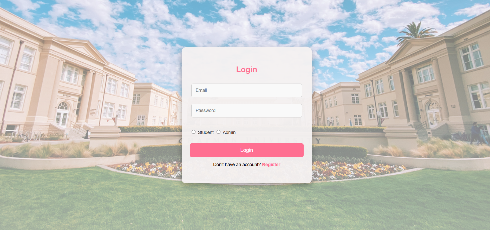
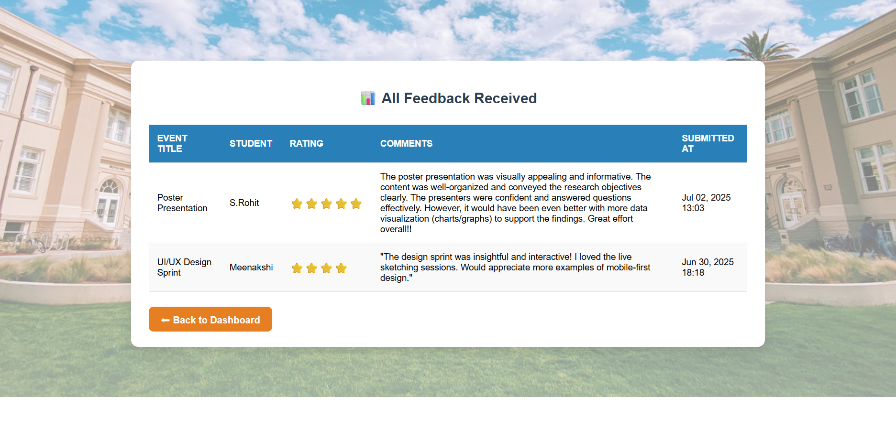
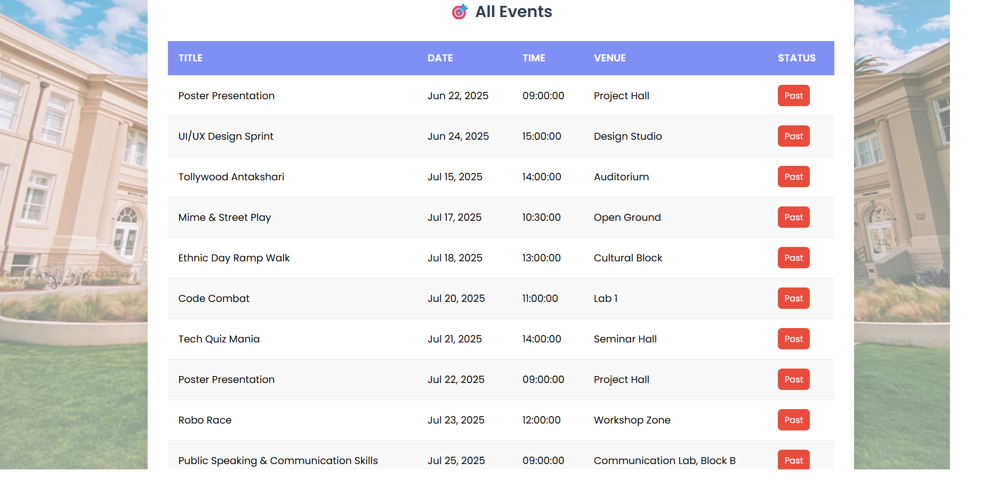
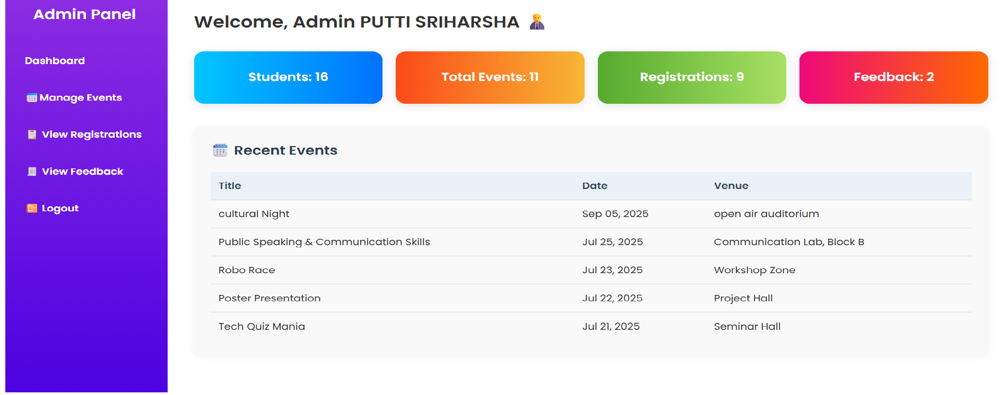
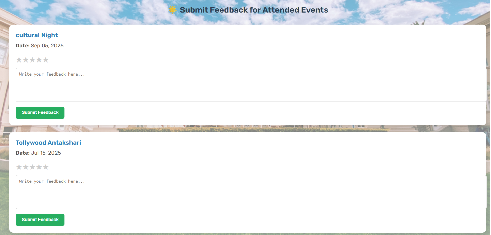
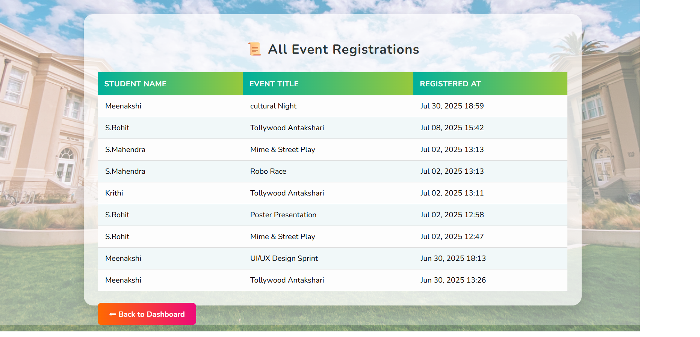
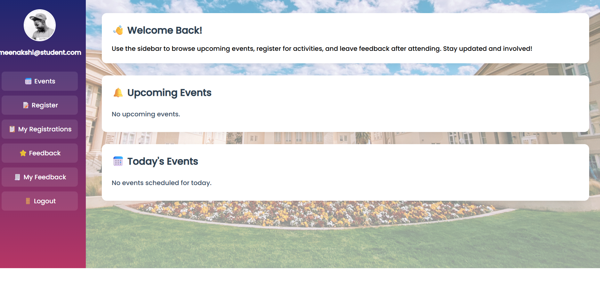
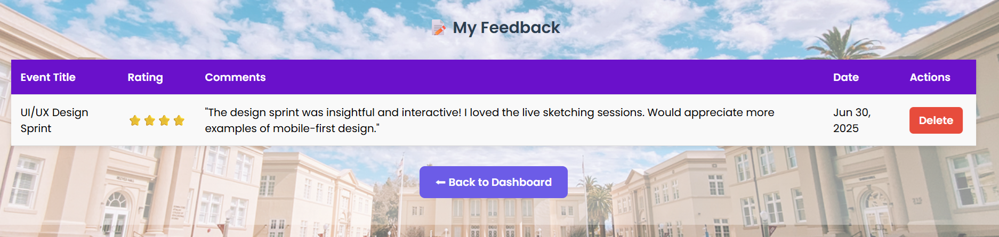

# 🎓 College Event Management System

A web-based application developed to manage college events efficiently.
It allows students to register for events, track participation, and submit feedback, while administrators can manage events and monitor activities.

---

## 🚀 Features

### 👨‍🎓 Student Module

* User Registration & Login
* View Available Events
* Register for Events
* View My Registrations
* Submit Feedback
* View Submitted Feedback

### 👨‍💼 Admin Module

* Admin Login
* Add / Manage Events
* View Student Registrations
* View Feedback

---

## 🛠️ Technologies Used

* **Frontend:** HTML, CSS, JavaScript
* **Backend:** PHP
* **Database:** MySQL
* **Server:** XAMPP / WAMP

---

## 📂 Project Structure

```
College_event/
└── college/
    │── connect.php
    │── login.php
    │── register.php
    │── student_dashboard.php
    │── admin_dashboard.php
    │── view_events.php
    │── event_register.php
    │── my_registrations.php
    │── student_feedback.php
    │── my_feedback.php
    │── logout.php
    │── manage_events.php
    │── database.sql
    │── screenshots/
    │── assets/
    │── css/
```

---

## ⚙️ Installation & Setup

1. Install XAMPP / WAMP
2. Start **Apache** and **MySQL**
3. Copy project folder to:

   ```
   C:\xampp\htdocs\College_event\
   ```
4. Open phpMyAdmin
5. Create database:

   ```
   college_event
   ```
6. Import:

   ```
   database.sql
   ```
7. Run project:

   ```
   http://localhost/College_event/college/
   ```

---

## 📸 Screenshots

### 🔐 Login Page



### 📝 Registration Page



### 🎓 Student Dashboard



### 👨‍💼 Admin Dashboard



### 📅 Events Page


### 🧾 Event Registration



### ⚙️ Manage Events



### 💬 Feedback Page



### 📊 My Feedback



---

## 🔐 Default Login

### 👨‍🎓 Student

* Email: [student@example.com](mailto:student@example.com)
* Password: 123456

### 👨‍💼 Admin

* Email: [admin@example.com](mailto:admin@example.com)
* Password: admin123

---

## 🚀 Future Enhancements

* Online Payment Integration
* Email Notifications
* Mobile Responsive Design
* Admin Analytics Dashboard

---

## 👨‍💻 Author

**Putti Sri Harsha**

---

## 📜 License

This project is developed for educational purposes only.

---
